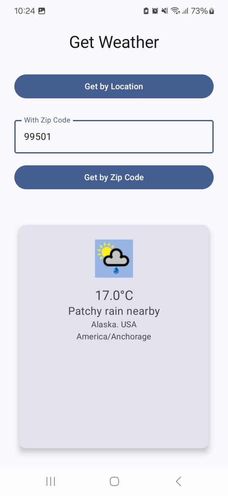
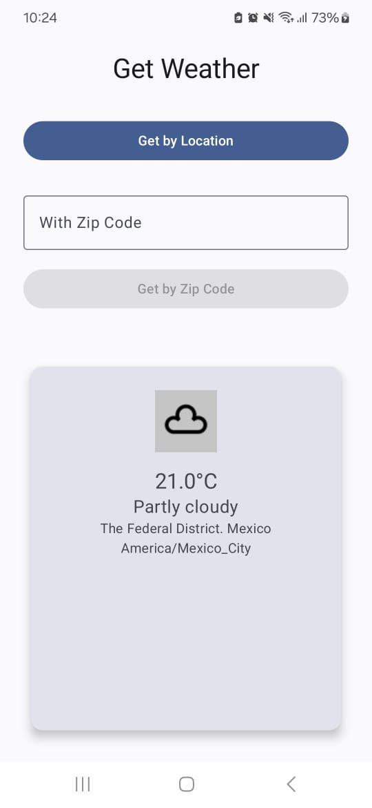
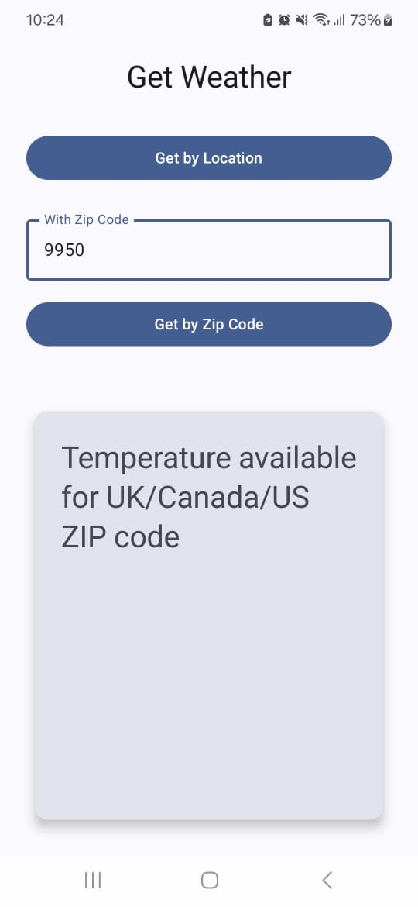
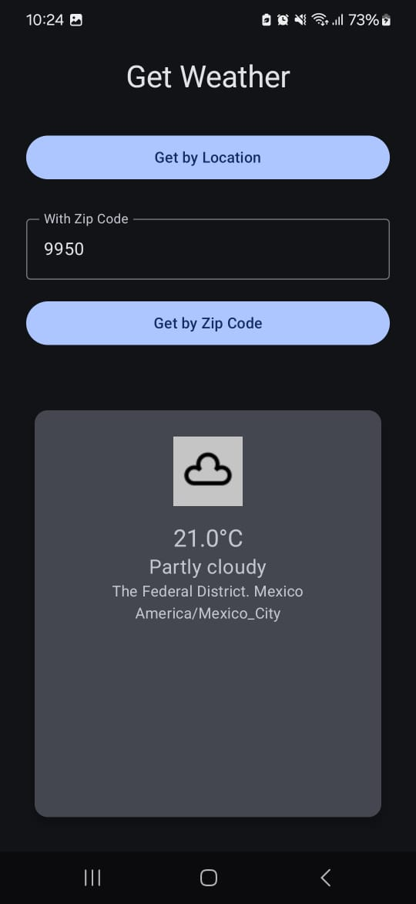
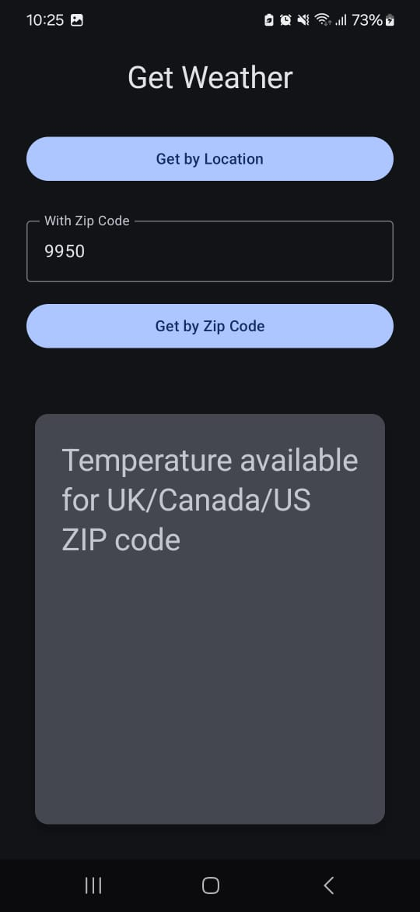
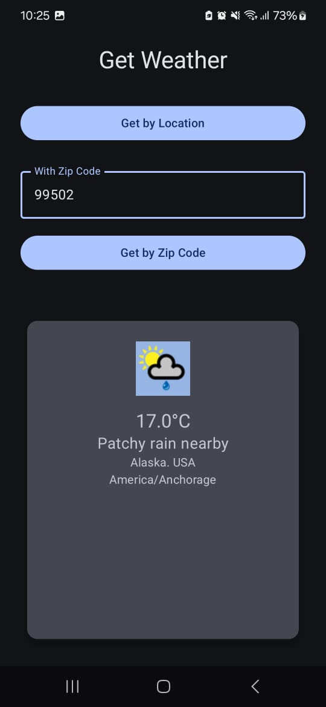

# 🌤️ WeatherApp
## 👨‍💻 Author
Developed by Jose Luis Pino Ucan
For feedback or questions: jose.ucan21@hotmail,com

## 📄 Description
A modern Android app to get real-time weather data using ZIP code or geographic coordinates. Built with Kotlin, Jetpack Compose, and follows clean architecture principles.

---

## 📸 Screenshots
<p align="center">
  
</p>
|  |  |  |
|  |  |  |

---
## 📍 Features

- Get weather data using:
    - ZIP code input
    - Device location (coordinates)
- Runtime location permission request
- Responsive UI using Jetpack Compose
- Weather icons shown using Glide 

---
## 🛠️ Tech Stack & Architecture

### 🧱 Architecture

The app follows the **MVVM (Model-View-ViewModel)** pattern, using `StateFlow` for UI state management.
I decided use clean architecture except domain layer because is a small project and for prevent boiler plate.  
UI (Compose)  
↓  
ViewModel (State & Events)  
↓  
Repository (Data Access)  
↓  
DataSource (Retrofit API)  

---

### 🔧 Libraries Used

| Purpose                | Library                             |
|------------------------|-------------------------------------|
| Declarative UI         | Jetpack Compose                     |
| Dependency Injection   | Hilt                                |
| Networking             | Retrofit + Gson                     |
| State Management       | Kotlin Coroutines + StateFlow       |
| Unit Testing           | JUnit                               |
| Location & Permissions | FusedLocationProvider (Google Play) |
| Image Loading          | Glide                               |

---
## 🧪 Testing

- Unit tests for repository layer using a fake API (FakeWeatherService.kt and WeatherRepositoryTest.kt).
- Uses `runTest` and `kotlinx.coroutines.test` for coroutine-based tests.

---
## 🔐 Required Permissions

- `ACCESS_FINE_LOCATION`: To fetch the user's current location.

---

## 🚀 Getting Started

1. Clone the repository:
   ```bash
   git clone https://github.com/joseluisucan/weater-app
